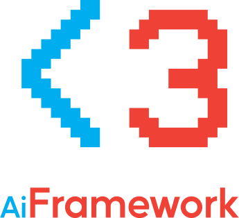
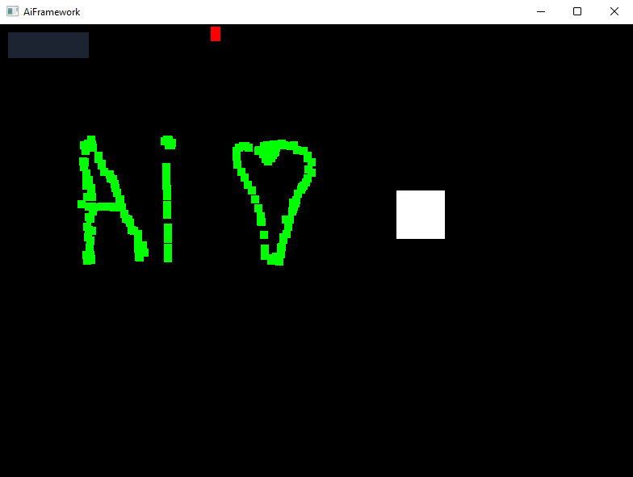

  

# AiFramework Test App

This is a test application for AiFramework, which was used throughout the development. It is a simple application that uses AiFramework in order to render some simple components and handle some input.

## How it looks?

Don't expect too much. It's just a test application. Other than that, here it is in all of its glory:

## What is all this abstract stuff going on? How do I use it?

W, A, S, D - moves the white rectangle
Left mouse button - creates a new green rectangle and makes the cursor(red rectangle) turn green
Right mouse button - makes the cursor(red rectangle) turn blue
Left + Right mouse buttons - makes the cursor(red rectangle) turn white and draws a green rectangle
The upper-left button clears all the green rectangles

## Great, how do I run it?

- Clone this repository with all of its submodules (AiFramework is a submodule for this repository) by running `git clone --recursive https://github.com/r0neko/AiFrameworkTestApp.git`
- Open the solution in Visual Studio 2022
- Set `AiFrameworkTestApp` as the startup project by right-clicking it and selecting `Set as Startup Project`
- Build and enjoy!

## AiFramework got updated and I didn't get the update! What do I do?

Simple! Just run `git submodule update --remote --merge` in the root of this repository. This will update the AiFramework submodule to the latest version in the main branch.

## I want to contribute! I think it deserves to be better!

In that case... great news for you! Just fork this repository, make your changes and create a pull request. I will review it and merge it if it's good enough.